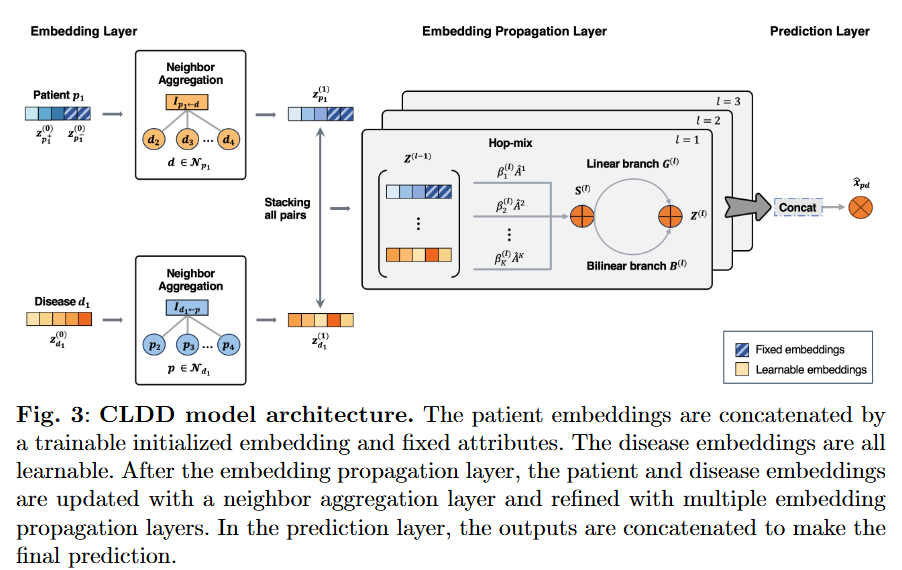
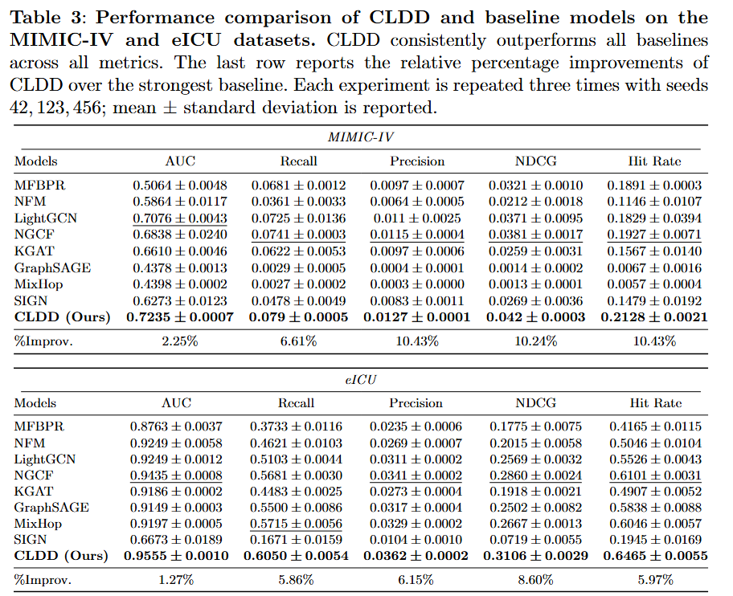

# Collaborative-Disease-Detection

Repository for **Medical Test-free Disease Detection Based on Big Data**. The main model **CLDD (Collaborative Learning for Disease Detection)** is implemented in `CDD/CDD.py` as a PyTorch `nn.Module` and trained from `CDD/main.py`.

## Model overview (CLDD)

- **Graph**: Bipartite user–disease graph with a normalized sparse adjacency (`s_norm_adj_mat2.npz`). Message passing runs for several layers with **multi-order neighbors** (learnable weights over powers \(A^1,\ldots,A^K\), default \(K=3\)).
- **Inputs**: Learnable user and item embeddings; item side concatenates an **ICD-derived feature block** with patient **demographic / fixed features** (`feature.npz`). Demographics can be disabled with `--use_demographics 0`.
- **Propagation**: Per-layer aggregation variants (`--aggregator_mode`: `sum_bi`, `sum`, `bi`), hop mixing (`--hop_mixing`: `adaptive` or `uniform`), and cross-layer readout (`--inter_layer_agg`: `concat`, `mean`, `last`).
- **Training**: Bayesian Personalized Ranking (BPR) on sampled triples; optional sparse **node** and **message dropout** during training.
- **Attribution / analysis**: `get_initial_embeddings()` builds pre-propagation node matrices; `forward_from_init(z)` runs the same propagation from an external, differentiable `z` (used for Integrated Gradients in `scripts/influence_attribution.py`). `predict_all_scores` exposes full-item dot-product scores for a patient.

## Setup

Create a conda environment (reference: Python 3.10) and install dependencies from the repo root:

```sh
conda create -n cldd python=3.10
conda activate cldd
pip install -r requirements.txt
```

Core dependencies include PyTorch, SciPy, NumPy, pandas, and scikit-learn (see `requirements.txt`).

## Data layout

Each dataset lives under `Data/<dataset_name>/`. The loader (`CDD/utility/load_data.py`) expects:

| File | Role |
|------|------|
| `train2.txt` | Training interactions: `user_id item_id item_id ...` |
| `test2.txt` | Test interactions (same format) |
| `feature.npz` | Sparse patient + disease feature matrix (aligned with users/items) |
| `s_adj_mat2.npz`, `s_norm_adj_mat2.npz`, `s_mean_adj_mat2.npz` | Precomputed adjacency (or built on first run and cached) |

Default `--dataset` is `mimicIV` (path `Data/mimicIV/`). ICD labels for reporting can be joined with `CDD/icd10_codes_all.csv` and `CDD/d_icd_diagnoses.csv`.

## Training

Run from the **`CDD`** directory so default `--data_path ../Data/` resolves correctly:

```sh
cd CDD
python main.py
```

Common overrides (see `CDD/utility/parser.py` for the full list):

```sh
python main.py --dataset mimicIV --gpu_id 0 --epoch 500 --lr 0.0001 \
  --embed_size 64 --layer_size "[64,64,64]" --batch_size 1024 \
  --weights_path model/ --save_flag 1
```

- **Checkpoints**: Best weights are saved under `--weights_path` when validation recall improves (`<epoch>.pkl`). If `model_ablation/259.pkl` exists, training resumes from that checkpoint (see `main.py`).
- **Efficiency log**: After training, `efficiency.tsv` is written under the weights directory (epoch time, convergence time, peak RAM/GPU, throughput).
- **Detailed test report**: By default the run generates `disease_prediction_result4.txt` and `high_accuracy_patients4.csv` in `CDD/`. Set `CDD_SKIP_DETAILED_REPORT=1` to skip this step.

## Influence attribution (Integrated Gradients)

From the **repository root**, pointing at a trained checkpoint and data root:

```sh
python scripts/influence_attribution.py --checkpoint CDD/model/<epoch>.pkl --data-path Data/ --dataset mimicIV
```

Optional: `--patient-a <id>`, `--aggregate-sample N`, `--ig-steps 50`, `--ig-baseline zero`. Outputs default to `rebuttal/` (case-level CSV and aggregate summary).

## Other scripts

Under `scripts/` you will find helpers such as dataset building (`build_eicu_dataset.py`), ablations and scaling (`run_cdd_ablation.py`, `run_cdd_mimic_scaling.py`), diagnostics/plots, and KGAT-related runners. Use `--help` on each script for usage.

## Figures and results

Fig. 1 illustrates high-order connectivity:

</img>

Model Architecture:

</img>

Table 3: performance comparison on MIMIC-IV and eICU:

</img>
